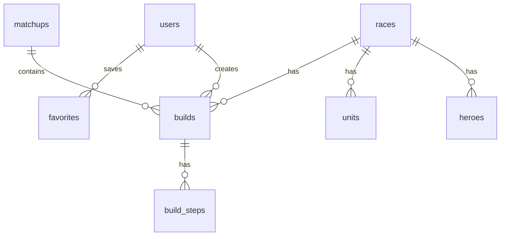

# AGENTS.md — WC3 Matchup Guide

## Project Context

You are working on **WC3 Matchup Guide**, a capstone project for the “Full Stack Apps with AI” course.

The app is a multi-platform full-stack guide platform for Warcraft III players. It helps users browse race guides, matchup guides, build orders, heroes, units, maps, and strategy tips. The project must satisfy the course requirements for a Next.js + PostgreSQL + Expo full-stack application.

The project should be built as a real production-style app, not a toy demo.

---

## Main Goal

Build and deploy a full-stack multi-platform app with:

- Next.js backend and web frontend
- PostgreSQL database hosted on Neon
- Drizzle ORM and migrations
- React + TypeScript + Tailwind web UI
- React Native + Expo mobile app
- JWT authentication
- User roles
- Admin panel
- RESTful API for the mobile app
- Server Actions for the web app where appropriate
- GitHub repo with clean commit history
- Live deployments for both web and Expo web export

---

## Product Description

WC3 Matchup Guide allows users to:

- Browse strategy guides by race
- View matchup guides such as Orc vs Human or Night Elf vs Undead
- Read build orders step-by-step
- View hero guides
- View unit and counter information
- Search and filter guides
- Save favorite builds or guides
- Use the site from desktop, mobile browser, or Expo mobile app

Admins can:

- Create guides
- Edit guides
- Delete guides
- Manage races, heroes, units, maps, builds, and matchups
- Manage published/draft status
- Seed and maintain content

Do not build chat, messaging, or a social network unless explicitly requested later. They are not needed for the MVP.

---

## Required Tech Stack

Use the following technologies unless the user explicitly changes the stack:

### Monorepo

Use a Node.js monorepo structure:

```txt
wc3-matchup-guide/
├── apps/
│   ├── web/       # Next.js app: backend + web client
│   └── mobile/    # Expo React Native app
├── packages/
│   ├── db/        # Drizzle schema, migrations, seed scripts
│   ├── shared/    # shared types, validators, constants
│   └── ui/        # optional shared UI utilities
├── AGENTS.md
├── README.md
└── package.json
```

### Backend

- Next.js App Router
- Route Handlers for RESTful API endpoints
- Server Actions for web-only mutations when useful
- PostgreSQL through Neon
- Drizzle ORM
- Drizzle migrations
- JWT authentication
- Password hashing with bcrypt or argon2
- Zod validation for request bodies

### Web App

- Next.js
- React
- TypeScript
- Tailwind CSS
- Responsive design
- Reusable components
- Accessible forms and navigation

### Mobile App

- Expo
- React Native
- TypeScript
- Consumes RESTful API from the Next.js backend
- Uses responsive layouts for phones and tablets
- Contains only the most important end-user functionality

---

## Database Design

Use at least these tables:

### users

Stores registered users.

Recommended fields:

- id
- email
- username
- passwordHash
- role
- createdAt
- updatedAt

Roles:

- user
- admin

### races

Stores playable races.

Recommended records:

- Human
- Orc
- Night Elf
- Undead

### heroes

Stores Warcraft 3 heroes.

Recommended fields:

- id
- raceId
- name
- slug
- description
- primaryAttribute
- role
- createdAt
- updatedAt

### units

Stores unit information.

Recommended fields:

- id
- raceId
- name
- slug
- description
- unitType
- strengths
- weaknesses
- createdAt
- updatedAt

### matchups

Stores race-vs-race matchup pages.

Recommended fields:

- id
- raceAId
- raceBId
- title
- slug
- summary
- difficulty
- earlyGamePlan
- midGamePlan
- lateGamePlan
- commonMistakes
- createdAt
- updatedAt

### builds

Stores build orders.

Recommended fields:

- id
- raceId
- matchupId
- title
- slug
- summary
- difficulty
- strategyType
- body
- createdByUserId
- isPublished
- createdAt
- updatedAt

### build_steps

Stores ordered build order steps.

Recommended fields:

- id
- buildId
- stepNumber
- supply
- timing
- instruction
- createdAt
- updatedAt

### favorites

Stores user-saved builds/guides.

Recommended fields:

- id
- userId
- buildId
- createdAt

### maps

Optional but useful.

Recommended fields:

- id
- name
- slug
- description
- creepNotes
- expansionNotes
- createdAt
- updatedAt

The project needs at least 4 tables, but aim for a richer schema because this domain naturally supports it.

Always use Drizzle migrations for schema changes.

Never manually change the production database schema outside migrations.

---

## Minimum Web Screens

The web app must contain at least 10 screens/pages/popups.

Implement at least:

1. Home page
2. Register page
3. Login page
4. Race list page
5. Race detail page
6. Matchup list page
7. Matchup detail page
8. Build order list page
9. Build order detail page
10. Hero list page
11. Hero detail page
12. User dashboard or favorites page
13. Admin dashboard
14. Admin create/edit build page
15. Admin create/edit matchup page

More pages are acceptable, but keep scope manageable.

---

## Minimum Mobile Screens

The Expo app must contain at least 5 screens.

Implement:

1. Home screen
2. Race guides screen
3. Matchups screen
4. Build orders screen
5. Build detail screen
6. Favorites screen
7. Profile/login screen

The mobile app should focus on browsing and saving guides. Do not implement the full admin panel in mobile unless specifically requested.

---

## Authentication and Authorization

Implement:

- Register
- Login
- Logout
- JWT token creation
- Password hashing
- Protected routes
- Role-based access

Rules:

- Only admins can create, update, or delete guide content.
- Regular users can browse public content.
- Logged-in users can save favorites.
- API endpoints must enforce authorization server-side.
- Do not rely only on UI hiding for security.

---

## API Design

Create RESTful API endpoints for the mobile app.

Example endpoints:

```txt
POST   /api/auth/register
POST   /api/auth/login
POST   /api/auth/logout
GET    /api/races
GET    /api/races/:slug
GET    /api/heroes
GET    /api/heroes/:slug
GET    /api/units
GET    /api/matchups
GET    /api/matchups/:slug
GET    /api/builds
GET    /api/builds/:slug
POST   /api/builds              # admin only
PUT    /api/builds/:id          # admin only
DELETE /api/builds/:id          # admin only
GET    /api/me/favorites
POST   /api/me/favorites
DELETE /api/me/favorites/:id
```

Use pagination on list endpoints.

Example pagination query:

```txt
GET /api/builds?page=1&pageSize=20&race=orc&matchup=orc-vs-human
```

Return predictable JSON:

```json
{
  "data": [],
  "page": 1,
  "pageSize": 20,
  "total": 0,
  "totalPages": 0
}
```

---

## Scalability Requirements

The app must demonstrate scalability.

Implement:

- Server-side pagination
- Search filters
- Database indexes on frequently queried columns
- Seed script that can create at least 10,000 records
- Efficient database queries with Drizzle

Suggested indexed columns:

- users.email
- races.slug
- heroes.slug
- units.slug
- builds.slug
- builds.raceId
- builds.matchupId
- matchups.slug
- favorites.userId
- favorites.buildId

Avoid loading all rows into memory.

---

## Seed Data

Create a seed script that inserts:

- Admin demo user
- Regular demo user
- Four races
- Multiple heroes
- Multiple units
- Multiple matchups
- Multiple build orders
- Build steps
- Enough generated records to test pagination and performance

Demo credentials:

```txt
Admin:
email: admin@example.com
password: demo123

User:
email: user@example.com
password: demo123
```

Never use these credentials for production outside the demo deployment.

---

## UI and UX Guidelines

The UI should feel like a clean gaming strategy database, not a generic admin template.

Use:

- Dark fantasy-inspired theme
- Race badges
- Clear card layouts
- Search and filter controls
- Icons for race, role, difficulty, timing, and build type
- Responsive navigation
- Good spacing
- Loading states
- Empty states
- Error states

Keep the UI readable and practical.

Avoid overcomplicated animations.

---

## Content Model Guidelines

Use clear structured content.

Example build order page sections:

- Overview
- Best against
- Weak against
- Opening steps
- Early game plan
- Mid game transition
- Late game plan
- Common mistakes
- Recommended heroes
- Recommended units
- Counters

Example matchup page sections:

- Matchup overview
- Race advantage notes
- Early game
- Mid game
- Late game
- Key units
- Hero choices
- Common mistakes
- Beginner tips

---

## Coding Standards

Use:

- TypeScript everywhere
- Strict typing
- Zod for validation
- Clean service functions
- Reusable components
- Server-side auth checks
- Consistent naming
- Environment variables for secrets

Avoid:

- Any `any` type unless unavoidable
- Duplicated query logic
- Hardcoded secrets
- Large components with too many responsibilities
- Client-side-only authorization
- Unpaginated large lists

---

## Environment Variables

Use environment variables such as:

```txt
DATABASE_URL=
JWT_SECRET=
NEXT_PUBLIC_API_URL=
```

Never commit real secrets.

Provide `.env.example`.

---

## Testing and Validation

At minimum, every feature should be manually tested.

When possible, add tests for:

- Auth service
- API endpoints
- Database access functions
- Form validation
- Important UI behavior

Before committing, run:

```bash
npm run lint
npm run typecheck
npm run build
```

If a command does not exist yet, create it or document why it is missing.

---

## Deployment

Deploy:

- Next.js backend + web client to Vercel, Netlify, or similar
- Neon PostgreSQL database
- Expo app as web export to Netlify, Vercel, or similar

The deployed web app must connect to the production database.

The deployed mobile web export must connect to the deployed REST API.

---

## Documentation Requirements

Create or update `README.md` with:

- Project description
- Features
- Tech stack
- Architecture overview
- Database schema overview
- Setup instructions
- Environment variables
- How to run locally
- How to seed the database
- Demo credentials
- Deployment links
- Screenshots if available

Also include a database schema diagram using Mermaid if possible.

Example:



---

## Git Workflow

The project assessment values GitHub history.

Use frequent commits.

Minimum required:

- At least 15 commits
- Commits across at least 3 different days

Recommended commit style:

```txt
feat: scaffold monorepo
feat: add drizzle schema
feat: implement auth api
feat: add race guide pages
feat: add build order pages
feat: add admin build editor
feat: add expo app navigation
fix: improve pagination query
docs: add setup guide
```

Do not commit huge unrelated changes in one commit.

---

## Implementation Order

Follow this order:

1. Scaffold monorepo
2. Set up Next.js web app
3. Set up Expo app
4. Configure TypeScript, linting, formatting
5. Set up Drizzle + Neon/PostgreSQL
6. Create database schema and migrations
7. Create seed script
8. Implement auth
9. Implement public guide APIs
10. Implement web guide pages
11. Implement admin CRUD
12. Implement mobile browsing screens
13. Add favorites
14. Add pagination/search/filtering
15. Add deployment config
16. Add README documentation
17. Final test and polish

---

## Scope Control

Prioritize required capstone features over nice-to-have features.

Do not implement these unless the main requirements are already complete:

- Real-time chat
- Forum system
- Replay parsing
- External Warcraft 3 API integration
- Complex recommendation engine
- Payments
- Notifications
- Full social network features

External APIs such as W3Champions can be added later, but the MVP should work with your own database first.

---

## Definition of Done

A feature is done only when:

- It is implemented
- It is typed
- It is validated
- It works in the UI
- It works through the API if needed
- It handles loading, error, and empty states
- It respects authorization rules
- It has been manually tested
- It does not break build/typecheck
- It is committed to Git

---

## AI Agent Behavior

When modifying this project:

- Read existing files before editing.
- Keep changes small and focused.
- Prefer simple, maintainable code.
- Explain major decisions in commit messages or documentation.
- Use Drizzle migrations for DB changes.
- Do not invent unrelated features.
- Do not remove existing working features without reason.
- Do not hardcode secrets.
- Do not skip auth checks.
- Do not create fake APIs when real backend endpoints are needed.
- Do not leave TODOs for required capstone functionality.

When uncertain, choose the simplest implementation that satisfies the capstone requirements.

---

## Project Name Options

Preferred name:

```txt
WC3 Matchup Guide
```

Alternative names:

```txt
WC3 Buildbook
WC3 Matchup Guide
Azeroth Strategy Codex
War3 Tactics Hub
```

Use **WC3 Matchup Guide** unless the user chooses another name.

---

## Final Project Summary

Build a complete guide and strategy platform for Warcraft III with web and mobile clients. The app should include race guides, hero guides, build orders, matchup pages, favorites, authentication, admin CRUD, database persistence, pagination, seed data, deployment, and documentation.

The project should be impressive enough for a capstone submission while staying realistic and manageable.
